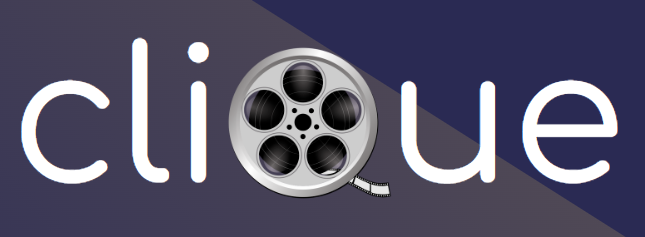

# Clique
#### _Largest social movie platform_

Clique is a social platform for movie enthusiasts.

- Social groups
- Movie search
- Meetups

Movie interested individuals, more specifically individuals who are interested in meeting new people and discussing movies over a beer. This user group is interesting simply because currently there is no specific platform to discuss movies, except for external groups on other platforms such as Reddit or Facebook. Our goal is to fulfil this user group with a platform specifically made for movie-interested individuals. 

The largest challenge with this user group is to convince the user group to move to our platform. What makes our application THAT interesting for the user group to use our app? This is a concern that could come up during the project and can be resolved by implementing convincing functionality that the application has to offer. 

## Tech
Packages/Framework that Clique uses for the application:

- [Flutter] - Build apps for any screen
- [Material Design] - Components, Colors etc
- [Firebase] - Backend
- [Go_Router] - Router management
- [Provider] - State management

## Team members

| Name | Role |
| ------ | ------ |
| Simon M | Project Management |
| Gustav | Lead Developer |
| Kiberewosen | Developer |
| Alexander | Developer |
| Minna | Developer |
| Kolia-Norvela | Design |
| Patrik | Design |
| Simon T | Design |

 
